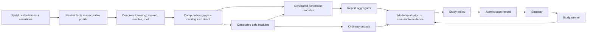

<!-- REFERENCE COPY. Canonical: sysml-codegen .project/concepts/constraint-execution-and-design-space-studies-claude.md (constraint-exec-epic). Do not edit here; cross-repo stage sessions cannot read outside their repo. -->
# Design: Constraint Execution and Design-Space Studies

**Status:** Proposed
**Owner:** Reid W
**Created:** 2026-07-11

---

## Overview

Engineers already model physical limits next to the calculations they constrain. Today those limits stop at a warning: the generated model computes values but never judges them, so every study re-implements the judgment by hand. This design makes modeled limits execute inside the generated forward model, exposes their verdicts as data, and adds a study layer that runs one point or thousands against the same evidence.

The core commitment is a three-way separation of responsibility. Calculations compute a candidate design state. Constraints observe that state and report whether it holds. A study decides what a verdict means for the exploration at hand — reject the point, penalize it, keep it for a boundary plot, or feed it back to a search strategy. Keeping the three apart lets one generated model serve manual runs, dense sweeps, uncertainty studies, and optimization without re-deriving anything.

---

## Problem

The authoring workflow captures three kinds of engineering knowledge: hardware structure, forward calculations, and physical limits. The first two survive generation — calculations become a typed executable graph, proven bit-exact against hand-verified anchors on a real fusion cost model. The third does not. A modeled limit is recognized, classified, and then reported as dropped; its predicate, its bindings, its concrete design context, and its truth value never reach generated code. The one demonstrated design-space sweep re-implements the viability rule by hand in its harness, where nothing stops it drifting from the model it claims to represent.

The execution framework compounds this. It runs one pipeline at a time, reading inputs from files, with no way to hand it in-memory values and no notion of a candidate or a study. Worse, its only vocabulary for "something is wrong" is an exception — which conflates an infeasible design with broken code. An infeasible design is a successful, informative evaluation; broken code is not. Today's sweeps escape the framework entirely by calling generated functions directly, giving up its validation and provenance to get throughput.

The missing system is not a solver. The forward model already knows how to compute its outputs. What it lacks is a trustworthy way to evaluate the modeled predicates over those outputs, keep the evidence alongside the ordinary results, and let an outer layer own the interpretation. History here argues for one more requirement: this system has repeatedly been bitten by things vanishing quietly. Whatever shape execution takes, silence must stop being a possible outcome for a modeled limit.

---

## Goals

- Execute every supported modeled assertion for each concrete design state, both live and from a captured snapshot.
- Preserve normal outputs and diagnostic evidence when an assertion is violated.
- Keep violation, indeterminacy, and execution failure as three distinct, queryable outcomes at every layer.
- Let people and agents define study variables, objectives, policies, and search methods without copying model equations.
- Serve auditable single runs and high-throughput studies from one sealed model contract.

## Non-Goals

- Solve algebraic equations, infer missing values, or add implicit loops to the forward graph.
- Prove temporal invariants or monitor time-series behavior.
- Assign hard, soft, advisory, objective, or penalty roles from names or assertion syntax.
- Execute requirement satisfaction, assumptions, or preconditions in the first scope; they stay visible but unassessed.
- Invent floating-point equality tolerances, universal margins, or normalized penalties.
- Ship optimizers in the first scope; the strategy interface is pluggable, and the first strategies are prepared lists and grids.

---

## Design Principles

### 1. Compute, Judge, and Decide Are Different Operations

Calculations produce a design state. Constraints observe that state and return evidence. Study policy decides what the evidence means for the current exploration. A relation that determines a value belongs in a calculation; a relation that limits or checks values belongs in a constraint; a rule about what to do with a violation belongs only in a study.

### 2. The Unit of Evaluation Is a Predicate in a Concrete Context

An assertion may own its predicate inline or select a reusable one and supply bindings. Neither means anything at runtime without its owning design instance, and inheritance or templates may turn one source assertion into several executions. Every result therefore belongs to exactly one effective predicate in exactly one concrete context, and carries an identity that says which.

### 3. Structure Survives; Reconstructed Text Does Not

Predicates, bindings, identities, and source facts travel as typed structural data through extraction, snapshots, and graph construction, and code is generated from that structure. Reconstructed expression text, name-matching, and dynamic evaluation are display and debugging aids, never semantic interfaces. This project has already paid for violating this once.

### 4. Violations Are Evidence; Exceptions Are Breakage

A false supported predicate is a successful evaluation that returned an important answer. Exceptions are reserved for evaluations that could not complete. The two never share a representation, at module, report, or study level.

### 5. Silence Is Never an Outcome

Every modeled limit ends in exactly one of three visible places: it executes and produces a verdict; it is cataloged as present-but-unassessed with its kind stated; or it blocks generation with its identity and the exact unsupported construct named. There is no path on which a limit simply disappears — including the offline path, where a stale snapshot without constraint facts must be rejected, not quietly generated without assertions.

---

## Architectural Bets

- **One ordinary graph module per concrete assertion, plus one report aggregator.** Constraints ride the existing DAG scheduling, provenance, and validation instead of a parallel engine. The aggregator gives every assertion a guaranteed execution path (only ancestors of the pipeline's exit are guaranteed to run) and one stable report artifact. Rejected alternatives: post-run harness evaluation (the drift we are retiring), producer-embedded assertions (no natural owner for cross-module predicates, and exceptions destroy infeasible points), a runtime constraint engine (couples a generic executor to one modeling language).
- **Predicates get a structural, serializable expression representation owned by the semantics library; codegen compiles it.** A permanently separate semantic representation is rejected — the long-term direction is one tree serving calculations and predicates, and the display-text reconstruction never grows into a compiler. Whether that tree extends an existing representation, becomes the shared tree immediately, or begins predicate-focused with an explicit convergence path is S2's decision, on evidence. *[AGENT] S2 ran 2026-07-11 and chose extract-and-migrate, staged (Appendix B, S2 spike result).*
- **The graph owns the catalog and the semantic contract; packaging seals them.** Everything generation needs is serializable graph data; after artifacts are written, a sealing pass hashes them into an executable fingerprint. Study tooling consumes the sealed contract, never module filenames or YAML internals.
- **Repeated-evaluation machinery is generic and lives in the runtime; SysML meaning stays upstream.** The runtime gains typed in-memory input injection, an evaluator protocol, and a study layer that work for any conforming model package. It never parses model semantics.
- **Strict resolution for assertion inputs: fail, never synthesize.** Calculation inputs historically fell through to synthesized entry points, caught only by a boundary check. Assertion actuals do not inherit that leniency — an unresolved actual is a generation error, and a missing actual is legal only when the formal has a modeled default: the default applies, and the formal is exposed as an overridable contract parameter retaining that default — eligible for explicit study selection, never a study variable automatically. This is the same rule today's library-default entry points already follow.

---

## Core Model

*Register shift: from here on, identifiers and file-level mechanisms are intentional.*

### Neutral Constraint Facts — agentic-mbse

`ExpressionIR` names the structural, serializable predicate representation — its relationship to the two existing expression representations is S2's decision, not this document's. Its required node algebra: literal, feature reference, unary/binary/n-ary operator, invocation, unit annotation, and an explicit unsupported node carrying a structural diagnostic. References keep source name, qualified target, and feature-chain segments; they do not pre-classify a value as channel, parameter, or intermediate — that is codegen's job.

`ConstraintDefinitionFact` carries a reusable predicate, formal parameters with defaults, and source identity. `ConstraintUsageFact` records exactly one `ConstraintSource` — an inline predicate, a constraint-definition reference, a named constraint-usage reference (the spec's assert-by-reference form, bound by reference subsetting), or a requirement-usage reference (satisfy) — and preserves actual expressions, owner, scope, membership kind, assertion polarity, and inheritance facts. *[AGENT] The four source forms classify assertions. S1's base-type sweep also surfaces two non-asserted shapes that are catalog entries, never executions: requirement-owned require/assume constraints (classified by membership kind, unassessed in first scope) and plain non-asserted constraint usages such as an assert-by-reference target (cataloged as the reference target, not as coverage). Spec must pin both so neither falls between "assertion" and "authoring inventory."* Inline and reusable sources put the effective predicate in different places (on the usage itself versus on the definition, evaluated in usage scope), so extraction treats them as two distinct lookups. Membership kind must be read from the owning membership (require/assume live on `RequirementConstraintMembership`, not on a usage subtype), which today's type-level classification collapses to "plain" — a known limitation these facts exist to fix.

The **executable profile** defines what may run: static scalar `AssertConstraintUsage` in the inline and definition-typed source forms, with owner-scope references or formals bound by explicit actuals or modeled defaults; comparisons, arithmetic, `and`/`or`/`not`, and negated assertion polarity. Assert-by-reference to a named usage blocks generation in the first scope with a named diagnostic; satisfy stays cataloged, unassessed. Equality is admitted by proof, never by guess. Boolean, enum, integer, and string equality are supported only when both operand types are recovered from the neutral facts and their compatibility is proven — an enum comparison is understood as enum equality against the right enumeration, catching invalid literals before execution, not as arbitrary string matching. Real-valued equality stays unsupported unless the model supplies explicit comparison semantics such as a tolerance (no such convention exists yet, and implying one would smuggle in exactly the invented tolerance the non-goals forbid); unknown, partially typed, or incompatible operands block generation; the compiler never guesses an operand category. An author who needs a numeric band writes it explicitly as two inequalities. Unit policy, first scope: comparison and arithmetic operands must be dimensionless or carry identical, structurally proven exact units; anything requiring conversion — including same-dimension different units — blocks generation with a named diagnostic, because runtime values are bare floats and units never convert silently. *[AGENT] S1 sharpened this: a feature typed only by a quantity kind (e.g. `LengthValue`) proves its dimension, never one exact runtime unit — its initializer does not fix future values — so it blocks in any unit-sensitive operation until some authoritative structural fact supplies the exact unit. Where that exact-unit contract comes from is an open spec-stage question; note this bites ordinary quantity-typed attributes, though not the first-scope models, which use bare Reals.* The profile replaces the current placeholder coverage check and the blanket "constraints are dropped" warning with per-construct eligibility diagnostics, and runs both at design review and at codegen preflight.

### Concrete Lowering — sysml-codegen

`ConcreteConstraint` is one effective predicate in one owner instance: source facts, resolved actuals, expected Boolean value, deterministic ID, and optional simple-inequality response metadata. Lowering is a **new pipeline phase** that reuses the virtual-usage expansion idiom but runs at a later seam than template-calc expansion does today: after aliases, the output registry, and supplied-value materialization are final, and before dependency backtracking — because actual resolution needs the finished registry. Part-definition-owned and inherited assertions expand once per concrete part instance; calculation-definition-owned assertions expand once per concrete calculation usage; an expected instance that cannot be formed is a validation error, not a warn-and-drop.

Actual resolution reuses the `OutputRegistry` and `BindingResolution` shape for channels — but entry-point resolution today lives inside the backtracker and includes fallback behavior, so lowering needs one shared resolver seam with an explicit strict mode; the fallback path is not a drop-in (a known entry-point-key collapse risk). Resolved constraint input channels join the backtracking roots before pruning, so a calculation whose only consumer is an assertion stays in a targeted graph. Lowering also needs a complete concrete part-instance index that does not derive from calc templates: today's instance discovery is driven by virtual calculation expansion, so a constraint-only part definition may have no discovered instances at all. Covering constraint-only definitions, nesting, inheritance and redefinition, multiplicity, and snapshot replay is a named implementation risk, gated by its own spike. Identity splits in two. The `constraint_id` is the **execution identity**: source-local identity plus concrete owner-instance identity plus membership kind plus polarity, all scoped to one executable fingerprint; a collision is a generation error and catalog ordering is deterministic by ID. Anonymous assertions may use an ordinal inside the source-local part, but that ordinal is never advertised as cross-version stability — no automatic scheme survives arbitrary source edits (ordinals move on insertion, locations move on edits, content hashes change with semantics). Cross-version correlation is a separate, optional, author-controlled **`tracking_key`**: name any constraint whose results must be compared across model versions. Names enable correlation, not equivalence — a named constraint whose predicate changes remains the same tracking subject, but its evidence spans different executable fingerprints and tools must show that boundary. Anonymous assertions have identity only within a fingerprint. The fingerprint *namespaces* IDs — it is never an input to them: artifacts contain the IDs, and the artifact hashes then form the fingerprint, so there is no circularity.

`PipelineModule` gains a real `module_kind` (calculation, formula, aggregation, constraint, report aggregator) replacing the accreted Boolean flags, and structured output schema identity becomes graph data — retiring the float-specialized wrapper assumption for these modules.

### Catalog, Evaluation, and Report

The graph embeds one `ConstraintCatalog` at two levels: a **source record** per asserted or applied constraint *usage* (source identity and form, membership kind, polarity, scope, source location, display expression, referenced-definition metadata when one exists) and a **concrete entry** per executable expansion, keyed by `constraint_id`, referencing its source record and adding concrete owner, execution eligibility, and optional response metadata. An unused `ConstraintDefinition` is authoring inventory, not execution coverage — it never appears as unassessed. Reporting can then group failures by modeled constraint while naming the failing instance. Every constraint that today lands in the drop-report manifest lands here instead — executable and explicitly-unassessed alike — and the manifest plus its blanket warning retire.

Each constraint module emits a compact `ConstraintEvaluation`: ID, actual value, `satisfied | violated | indeterminate`, optional signed margin, bounded diagnostic. Status compares the actual value against the assertion's expected value — a negated assertion expects false, so a false predicate there is satisfied. Generated predicate code evaluates under three-valued (Kleene) semantics: a non-finite operand makes its own leaf comparison unknown, and unknown propagates only where a connective needs it — `true or unknown` is true, `false and unknown` is false — so an assertion is indeterminate only when its overall value is unknown. This is a deliberate divergence from raw IEEE evaluation, which would return a confident `false` from a broken value. The module never raises because the verdict went against the assertion. A margin exists only for simple inequalities where structure fixes its sign, and the sign respects polarity (a negated inequality's margin is negated); compound predicates report status only. Each evaluation also carries bounded explanatory evidence — the observed operand values needed to explain this case, such as response and bound for a simple inequality — keyed against the catalog's statics; the exact schema is design detail, but "violated" without the values that violated it is not acceptable evidence.

`ConstraintReport` carries the catalog fingerprint, assessed coverage, ordered results, and a headline that resolves by precedence: any violation, else any indeterminate, else all-satisfied, else not-assessed for zero assertions. The aggregator has a generated exact input schema — one required field per concrete assertion, so a missing result is a schema failure, not a silent gap — exists even for zero assertions, and is an ancestor of the exit point.

### Contracts and the Evaluator

`ModelContract` derives solely from graph fields: stable parameter and output IDs, the constraint catalog, required evaluation semantics, and a semantic fingerprint; *provided* capabilities — available backends, in-memory entry support, persistence modes — are package and runtime facts and live in `PackageContract`, not the graph. `PackageContract` seals it after artifact generation: content hashes over the generated and preserved (handwritten) artifact set, excluding the seal itself and runtime outputs, plus generator and runtime versions — verified on package load, not just at packaging. The generated package ships a `ModelEvaluator` adapter returning immutable `ModelEvidence` — a runtime-owned generic envelope: response entries keyed by stable IDs (constraint verdicts project onto generic response keys), selected outputs, provenance, and the full generated report attached as an opaque model artifact, so runtime types never depend on generated classes. Every evaluation failure surfaces as one normalized outcome: phase, module or channel when known, cause, retryability, and partial-artifact status. The first backend is a prepared pipeline — validate and build topology once, fresh execution context per case — fed by a typed in-memory entry source; the file-backed path remains for auditable runs, with finishing, auditing, and merging the runtime's in-flight scalar-persistence work as a prerequisite, alongside a direct producer-to-consumer type-continuity test. Faster backends are admitted only on case-level parity.

### Study Layer — TEAx

`StudyDefinition` selects variables and domains by parameter ID, observables by output ID, objectives, response roles, failure policy, strategy, budget, and retention; it cannot redefine a predicate. `CandidateStrategy` implements propose/observe for lists, grids, samplers, and later optimizers. `StudyRunner` follows one order: validate and canonicalize the proposal, evaluate, assess immutable evidence, atomically commit the `CaseRecord`, then advance strategy feedback. Identity has three layers — `proposal_id` (raw strategy output), `candidate_id` (the validated logical evaluation; deliberate replicates get distinct candidate IDs even with identical inputs), and `attempt_id` (one execution try) — with idempotency scoped to (`study_id`, `candidate_id`), so failed attempts are preserved without ever committing two case results for one logical candidate.

An invalid proposal never becomes a candidate: it persists as an append-only `ProposalRecord` keyed by `proposal_id`, so "candidate" always means a canonical evaluation that reached the evaluator. `CaseRecord` keeps `completed`, `execution_failed`, and `assessment_failed` distinct. `StudyStore` (SQLite first — atomicity and idempotency are required behavior, not scale features) is append-only for committed case evidence and attempt history, with controlled mutable operational state such as cursors kept separate. Database and filesystem writes cannot share a transaction, so artifacts follow a staging protocol: write to staging or content-addressed storage, make durable, then commit the case record and artifact references in one transaction — unreferenced staged artifacts are collectable garbage, and a reader never sees a committed case pointing at half-written artifacts. At creation the store binds immutable compatibility fields (executable, model-contract, and study-definition fingerprints; input and evidence schema versions; strategy identity and configuration); opening it with incompatible values fails explicitly, and any change starts a new study lineage. First delivery is candidate source → validation → evaluator → atomic store; adaptive checkpointing, replayable feedback, parallel workers, and optimizer state restoration are deferred until crash-resume semantics are proven — an adaptive strategy must then be replayable from ordered feedback plus a seed, checkpointed atomically with its cursor, or declared non-resumable up front.

---

## Diagram

---

## Required Invariants

### Semantics and Identity

- One `constraint_id` maps to exactly one effective predicate source, usage, concrete owner instance, membership kind, and polarity within an executable fingerprint; IDs and catalog ordering are identical across live and snapshot generation.
- Membership kind, polarity, ownership, and inheritance facts survive extraction, snapshot round-trip, and generation unchanged.
- Every asserted predicate either lowers to a module or blocks generation naming its identity, the unsupported construct, and its source location; non-assert kinds appear in the catalog as unassessed.
- A snapshot predating the constraint-facts format version is rejected by the existing version hard-gate, and a current-version snapshot missing the constraint-facts section fails rather than loading as an empty catalog; a model that asserts something never quietly generates an assertion-free package.
- An expected concrete instance that cannot be formed fails validation.

### Graph and Evaluation

- Predicate, catalog, schema, and contract data are serializable graph fields; generation reads only the graph.
- Constraint actual resolution has no textual fallback and no entry-point synthesis; unresolved means generation error.
- Every concrete assertion and its transitive producers are ancestors of the report aggregator and the exit point.
- An assertion whose actual value differs from its expected value returns `violated` — never raising or suppressing ordinary outputs; a non-finite operand makes its leaf comparison unknown under three-valued propagation, and only an overall-unknown assertion is `indeterminate`; missing inputs, schema failures, thrown predicate code, or a missing aggregator field are execution failures.
- Margins exist only where predicate structure fixes their sign, and the sign respects assertion polarity; no aggregate margin for compound predicates.
- Generated modules validate values inside `run()`; producer and consumer channel types match exactly; every constraint and report schema is registered.
- Migration: every constraint in today's drop manifest maps to exactly one source record in the new catalog, and every source record expands to one or more concrete entries; the blanket warnings retire with the manifest.

### Study Execution

- Proposal records and the three case states never merge; policy assessment never mutates stored evidence.
- Auditable and fast evaluators return equivalent selected outputs and constraint results for the same canonical inputs.
- Atomic case commit precedes strategy feedback; a persistence or infrastructure failure never yields a completed case, and a committed case never references half-written artifacts (artifacts are staged durably before the commit).
- Resume joins on study lineage, executable and study fingerprints, and candidate identity — never on constraint IDs alone; that combination makes resume idempotent and prevents mixed-model datasets.

---

## How It Works

### Author and Generate

An engineer models limits as inline or typed assertions — the live-validated toy is the shape: a reusable `'Cost Within Budget'` definition owning `cost <= budget`, and an `affordable` usage binding `cost` to a calc output and `budget` to a design attribute. The executable profile judges every assertion during prototyping and again at preflight. Lowering expands assertions per concrete instance, resolves `cost` to its producer channel and `budget` to an entry point, adds both as backtracking roots, and generation emits the constraint module, the aggregator, the catalog, and the sealed contracts.

### Evaluate One Design Point

The evaluator takes typed values keyed by contract parameter IDs, validates them against the prepared pipeline, and runs a fresh context. Constraint modules consume entry values and upstream outputs like any module; the aggregator emits one report beside the ordinary outputs; the evaluator returns both as immutable evidence. A file-backed run produces the same evidence plus auditable artifacts.

### Run a Study

The runner asks the strategy for candidates. Invalid proposals persist as proposal records and never touch the model. Valid points evaluate; policy classifies the evidence; evidence and assessment commit atomically; only then does the strategy see feedback. A rejected point keeps its outputs and violations for boundary plots. Model, assessment, and persistence failures stay phase-distinct.

### Inspect and Resume

Results query by parameter, output, constraint ID, status, and assessment, joining static source detail through the catalog. Resume refuses a changed executable or study fingerprint and restores strategy state by replay or checkpoint; a non-resumable strategy declares itself before the first case.

---

## Edge Cases and Failure Modes

- An assertion is the only consumer of a calculation: root status keeps the producer in targeted graphs.
- An inherited assertion lands on several instances: one deterministic ID and result per instance.
- An assertion uses an unsupported construct (invocation, conditional, temporal, unit conversion, real equality): generation blocks, naming construct and location; the authoring fix for real equality is an explicit two-inequality band.
- A module raises or the aggregator misses an input: execution failure; partial channels make no assertion claims. An operand that is NaN or infinite is different: that assertion is indeterminate, and policy decides the point's fate.
- A model has no assertions: the report says not-assessed; documented-only constraints can never yield a false all-satisfied.
- An old snapshot is loaded, or a current one lacks the constraint-facts section: both fail with a re-capture instruction; neither loads as an empty catalog.
- A part definition owns constraints but no calculations: instance discovery must still find its concrete instances; calc-template-derived discovery would find none — the instance-index spike gates this.
- Runtime scalar handling: constraint modules bind whole channels and emit structured models, avoiding the known field-reference gap on scalar channels; the larger unproven risk — ordinary producer-to-consumer scalar type continuity — gets a direct test.
- Scale (thousands of cases; very large assertion fan-in): values live in case records with source metadata once in the catalog and per-case files off; module fusion is revisited only past a measured aggregator-schema limit.
- Objective extraction or policy fails: evidence is preserved in an assessment-failed record, never relabeled model failure.
- Persistence fails: no completed case, a retryable phase-tagged event, replay from the last commit.
- Anything in the model, generator, or runtime changes mid-study: fingerprint mismatch starts a new lineage.

---

## Vocabulary

- `forward model`: directed computation from fully supplied inputs to outputs; solves nothing.
- `constraint definition` / `constraint usage`: reusable Boolean predicate with formals / its application in context, owning or selecting the effective predicate.
- `concrete constraint`: one executable usage in one concrete owner instance.
- `executable profile`: the published decision procedure for whether an assertion may run.
- `model contract` / `package contract`: graph-derived semantic catalog / its artifact-hash seal.
- `constraint report`: assertion evidence and coverage for one design point; never a feasibility decision.
- `tracking_key`: optional author-controlled name correlating a logical constraint across model versions.
- `study policy`: user-selected interpretation of evidence for one exploration.
- `proposal` / `candidate` / `attempt` / `case` / `lineage`: raw strategy output, persisted even when invalid / validated logical evaluation (replicates distinct) / one execution try / a candidate's committed record / all cases sharing one compatibility binding.

---

## Validation Strategy

- Live-probe learning tests freeze the modeling-tool fact shapes (ownership, membership, negation, inheritance, bindings, compound ASTs) before any schema commits — and gate equality: for an equality expression the facts must classify both operands and prove compatibility, covering enum against its own enumeration, incompatible enums, integer/real promotion, quantities with the same unit, same-dimension different units, and incompatible dimensions, unit-bearing arithmetic, unitless versus dimensioned values, unresolved operands, and inherited or aliased types.
- Expression parity runs the live oracle in both source forms — typed usages via the proven two-step (evaluate the definition's predicate expression with the usage as scope), inline usages via their own result expression — against compiled Python over satisfied, violated, boundary, and non-finite points, with non-finite values in every Boolean position and the oracle asserting the documented three-valued truth table there rather than raw SysIDE equality (that divergence is by design), plus byte-stable serialization round-trips. The same spike decides the shared tree's relationship to the two existing expression representations — extend, extract-and-migrate, or predicate-focused with an explicit convergence path — never a silent third IR or a forced calculation rewrite; until it runs, this concept states the required properties of the neutral facts and deliberately leaves the canonical tree undeclared.
- Codegen: expansion (including a constraint-only part definition with multiple instances and inheritance), strict resolution, ID determinism, module-kind and schema generation, live/snapshot parity, and snapshot-rejection tests. Reachability is proved with pruning enabled and a minimal exit selection, so liveness comes from the constraint dependency rather than from every output already feeding the exit.
- Runtime: in-memory versus file-path parity, report precedence, phase-distinct failures, atomic commit with crash-resume, scalar-persistence regression pin.
- Acceptance: the IFE sweep's hand-coded viability rule is replaced by the generated assertion and every existing grid classification matches.

---

## Next-Stage Handoff

**Settled here:**
- Calculations compute, constraints judge, studies decide; silence is never an outcome.
- Per-assertion modules plus an exact-schema report aggregator, on the ordinary graph, are the execution shape.
- The graph owns one catalog and semantic contract; packaging seals them; study assessment never touches stored evidence.
- First scope: static scalar assertions (inline and definition-typed) with negation, owner-scope references or explicit actuals, Boolean composition; real-valued equality blocked pending a modeled-tolerance convention, other equality gated on proven type recovery.
- Strict actual resolution; defaulted formals keep their modeled defaults as overridable contract parameters, varied only by explicit study selection.

**Spec/design detail still needed next:**
- Exact fact/graph/report schemas, ID encoding, snapshot version, diagnostic taxonomy, package and evaluator APIs.
- Study, policy, store, and CLI contracts; failure-event and provenance shapes.
- The shared strict-resolution seam, the complete part-instance index, the normalized failure outcome, and the seal's full integrity protocol (coverage set, stale-file detection, environment compatibility).
- Migration of the drop manifest, both blanket warnings, existing tests, and the authoring guidance that currently teaches "constraints are not executable."

**First risk to de-risk:**
- Spikes S1 (fact shapes, all four source forms, equality typing matrix) and S5 (TEAx typed entry + scalar continuity) start immediately and in parallel — S1 blocks every schema, S5 depends on nothing upstream. Full scope, intent, and pass criteria for all six spikes: Appendix B.
- [AGENT] S1 completed 2026-07-11 against live SysIDE 0.8.4: all four source forms, membership kind, polarity, ownership, actuals/defaults, compound expressions, and inheritance/retyping are statically recoverable. The equality gate admits Boolean, string, integer, and same-enumeration equality; real-valued equality and any case with incompatible types, required unit conversion, unresolved operands, or an unknown exact quantity unit block explicitly. Exact unit is conditional: a quantity feature typed only by dimension does not prove one runtime unit. See `../../../agentic-mbse/.project/active/spike-constraint-fact-shapes/findings.md`.
- [AGENT] S1 review carry-forwards (2026-07-11, verified: 5 kept tests pass live; golden matches fixtures): (1) two capture-code rules are fixture-coupled heuristics production must not imitate — inline vs definition-typed must be decided by whether the usage owns a `result_expression`, not by a namespace prefix, and quantity dimensions must resolve structurally, not by stripping a `Unit` name suffix; (2) the golden type/unit matrix pins `==` only — inequality-side unit gating (e.g. `1 [m] <= 100 [cm]` blocks; `integer <= real` is supported, promotion only poisons equality) rests on the same operand facts but has no pin yet; add one when the production profile is built, or in S4.

---

## Summary

Modeled limits become traceable responses of the generated forward model — never exceptions, never solver hints, and never silent. A graph-owned, package-sealed contract lets the runtime evaluate one point or a whole study while violation evidence, feasibility policy, invalid candidates, and genuine breakage stay permanently distinct.

---

## Appendix A: Verification Verdict Summary

Three read-only sweeps, 2026-07-11, against sysml-codegen `main`, agentic-mbse HEAD (`d340c8e`), teax HEAD.

- **sysml-codegen** — confirmed: manifest-only constraint path (`constraint_report.py:62-75`); `constraints = []` stub (`extractor.py:197-198`); snapshot strips ASTs, serializes `dropped_constraints` (`serializer.py:35-43,108`); compiler is arithmetic-only with no Boolean node, and its `[` entry is a unit-annotation strip, not indexing (`expression_compiler.py:151-159,347-350`); Boolean flags not `module_kind` (`models.py:181-182`); graph seeded only from backtracked calc usages (`graph_builder.py:161,214`); `OutputRegistry`/`BindingResolution` exist as described (`core/output_registry.py:26`, `core/models.py:13-68`); templates/stencils float-specialized (`teax_module.py.jinja2:36,79,122`; `stencils.py:86-115`); fall-through entry synthesis with V11 at boundary (`dependency_backtracker.py:542-598`, `cli/__init__.py:228-270`); none of the proposed types exist; `constraint_extractor.py` deleted.
- **agentic-mbse** — confirmed: expression reconstruction handles comparison/logical/Boolean as display text only (`expression.py:377-448`); L4 placeholder reports 0% by design (`level4_constraints.py:57-69`); L6 blanket per-constraint warning (`level6_architecture.py:622-631`); adapter subtype sweep + droppability single-sourced (`syside_adapter.py:43,270,410-425`); no structural predicate, membership-kind, or negation capture anywhere; PUSH-DOWN shared modules establish the neutral-semantics-live-here pattern.
- **teax** — confirmed: validate → DAG → topological execution (`pipeline_validator.py:65`, `pipeline_graph.py:29-89`, `pipeline_executor.py:126`); executor breaks at the exit module so only exit ancestors are guaranteed (`pipeline_executor.py:131-139`); module exceptions escape, only validation errors caught (`pipeline.py:181-202`); inputs are file-only, no in-memory injection API; `RunResult` carries outputs/manifest/versions/metadata/provenance (`pipeline_executor.py:57-64`); zero study/sweep/constraint machinery repo-wide. Scalar-persistence caveat: an early read of the dirty working tree found scalar and `RootModel[scalar]` handlers in `output_router.py`, but those are uncommitted — HEAD `c9e1e85` still lacks them, and teax's `CURRENT_WORK.md` records the work as "Implementation Complete — audit and pre-PR verification pending." The prerequisite therefore stands: finish, audit, and merge that in-flight work before relying on it.

## Appendix B: De-risking Spikes — Scope, Intent, Pass Criteria

Six spikes (S1–S6) plus a deferred seventh (S7). Each names the assumption it tests; a spike that cannot fail is not run.

### S1 — Constraint fact-shape learning test (`agentic-mbse`, live SysIDE) — START FIRST

**Intent:** freeze the neutral fact schema against modeling-tool reality before any cross-repo schema commitment. Every schema in this design hangs on what S1 finds.
**Scope:** a committed fixture matrix and kept tests covering all four `ConstraintSource` forms (inline; definition-typed; assert-by-reference to a named usage with `:>>` rebinding; satisfy), membership kind read from the owning membership (require/assume), negation polarity, ownership (part-definition, calc-definition, direct usage), inheritance and retyping, anonymous assertions, actuals (owner-scope references, feature chains, literals, omitted defaulted formals), compound Booleans — and the type/unit matrix: enum against its own enumeration, incompatible enums, integer/real promotion, quantities with the same unit, same-dimension different units (detected, and blocked in first scope), incompatible dimensions, unit-bearing arithmetic, unitless versus dimensioned values, unresolved operands, inherited and aliased types. Emit golden JSON facts plus diagnostics.
**Pass/decision:** every field the design needs is recoverable without invoking the evaluator; any unrecoverable field is cut from the schema or becomes an explicit profile restriction. The equality gate (which operand categories are admitted) is decided by this evidence, not by assumption.

### S2 — Expression-tree parity and the IR relationship decision (`agentic-mbse` + `sysml-codegen`)

**Intent:** prove one neutral tree serializes byte-stably and compiles to Python that matches live semantics; decide, on evidence, how it relates to the two existing expression representations.
**Scope:** compile the WI-014 predicate, the IFE viability predicate, an inline owner-reference predicate, a negated assertion, and a compound Boolean. Run the live oracle in both source forms — typed usages via the proven two-step (definition's predicate expression, usage as scope), inline usages via their own result expression — over satisfied, violated, boundary, and non-finite points, including margin sign under negation and non-finite values in every Boolean position. At non-finite points the oracle asserts the documented three-valued (Kleene) truth table, not raw SysIDE equality — the IEEE divergence is by design. JSON round-trip every tree.
**Pass/decision:** Python and SysIDE agree on every supported point; disagreeing nodes are excluded from profile v1. Chooses extend / extract-and-migrate / predicate-focused-with-convergence, and fixes the operator/type matrix. Consumes S1's shapes.

**Spike result — [AGENT], 2026-07-11:** Parity confirmed: all five predicate shapes in both source forms agreed with the live oracle on every point SysIDE could complete (22/22), with byte-stable JSON round-trips within and across loads, correct margin signs under negation, and the full Kleene table verified at non-finite points — where live SysIDE returned a confident, diagnostic-free `False` from a `1.0/0.0` operand, proving the documented divergence necessary. Relationship decision: **extract-and-migrate, staged** — a thin compat rendering of the shared tree reproduced today's calc compiler output byte-identically for every fixture and stress expression, so one tree serves both consumers; `ExpressionAST` retires at the expression-compiler seam under the existing byte-identity gates, predicates first. Operator matrix v1: comparisons, `and`/`or`/`not`, arithmetic with unary minus and `^`, and defaulted formals are in; equality (S1's gate governs categories), `xor`/`implies`, invocation, feature chains, and unit conversion are blocked with diagnostics. Oracle-envelope facts for S4: SysIDE cannot resolve usage-supplied cross-part actuals for def-owned assertions, and self-named bindings hit the step limit — live comparisons there must anchor on hand-transcribed literals. See `.project/active/spike-expression-tree-parity/findings.md`.

*[AGENT] S2 review carry-forwards (2026-07-11, verified: all seven probes re-run green, including the cross-part scope sweep and the silent-`False` live check):* (1) the "~zero convergence cost" measurement covers the expression-compiler seam only — aggregation walking, computed attributes, and snapshot `compilation_results` replay are separate calc consumers that migrate in their own staged steps under the byte-identity gates; (2) the predicate compiler strip-renders unit annotations and is **not** a unit safety net — the executable-profile gate (S1's matrix) must run strictly before compilation, or a unit-mismatched comparison compiles to a bare-float comparison; (3) spec nit: at an exact boundary a negated inequality yields margin `-0.0` — spec should state boundary margin is zero with no meaningful sign; (4) the IR's n-ary operator capacity is latent (live SysIDE emits nested binary for infix), so no parity evidence exists for true n-ary nodes — fine while the constructs that could produce them stay blocked.

### S3 — Concrete expansion and the instance index (`sysml-codegen`)

**Intent:** prove instance discovery independent of calc templates — the named risk that a constraint-only part definition currently has no discovered instances — and prove ID determinism through snapshot replay.
**Scope:** a constraint-only part definition with multiple instances; nesting; inheritance and retyping; multiplicity. Expand per instance, generate execution IDs, round-trip the snapshot, and prove rejection of both an old-version snapshot and a current-version snapshot missing the constraint-facts section.
**Pass/decision:** a complete part-instance index exists or the gap is named and becomes an explicit profile restriction; IDs and catalog ordering are byte-identical live and from snapshot. Can start once S1's fixtures exist, in parallel with S2.

**Spike result — [AGENT], 2026-07-11:** Live part structure is sufficient, but the complete production index does not exist yet. The current calc-independent base-owner lookup found nesting, retyping, and fixed multiplicity but missed a plain subtype inheriting the base constraint; the downstream helper found nothing with zero virtual calculations. A test-only subtype-closure projection plus fixed `[3]` expansion found all nine expected occurrences with byte-identical IDs and catalog ordering across repeated live loads and strict snapshot replay. Production snapshot v2 rejects v1 but still accepts a current snapshot without executable facts; a strict test-only boundary rejected both old and missing-facts inputs. Implement one part-structure-owned index with subtype closure and concrete-cardinality expansion, make constraint facts load-bearing in the bumped snapshot version, and block multiplicities whose finite cardinality is unavailable at lowering. See `.project/active/spike-concrete-expansion-instance-index/findings.md`.

*[AGENT] S3 review carry-forwards (2026-07-12, verified: documented reproduction exits 0 with 9/9 prototype instances, the plain-subtype miss, byte-identical repeated loads, and both strict rejections):* (1) the probe keys multiplicity counts by bare leaf usage name and asserts the fixture has no collisions — production must key them by owning definition plus feature (the extracted fact already carries `owning_part_def_qn`), or two same-named members with different counts will collide; (2) the snapshot leg proves *carriage* stability — the computed catalog serializes and reloads byte-identically — not re-derivation: recomputing IDs from snapshot facts through the real lowering path is S4's live/snapshot parity burden; the genuinely non-trivial determinism proven here is across independent live loads; (3) fixed-multiplicity occurrences expand to structurally identical siblings — lowering must give each occurrence its own channels or their verdicts are copies, which is a spec-time wiring question, not an index question.

### S4 — Vertical slice: lowering, liveness, generation, execution (`sysml-codegen` + TEAx)

**Intent:** prove the whole cross-repo seam on one real model — and make the liveness claim falsifiable.
**Scope:** feed S1's captured facts for WI-014's `affordable` through a test-only lowering path: strict resolution of `cost_calc.cost` and `plant_budget`, roots before pruning, one structured constraint module plus the exact-schema aggregator, schemas/registry/YAML/contracts. Run **with pruning enabled and a minimal exit selection**, so the cost calculation survives only via the constraint dependency — not because every output feeds the exit. Execute true and false points; compare live and snapshot artifacts.
**Pass/decision:** both truth values complete with identical ordinary outputs and the expected report; targeted generation retains the producer; live/snapshot artifacts match. Failure selects the exact graph or schema seam to redesign before production work. Consumes S1–S3.

**Spike result — [AGENT], 2026-07-11:** All three pass criteria hold, under the **real** TEAx runtime, with zero production-code changes in any repo. Both truth values completed with identical ordinary outputs (area 12.0, cost 3000.0), correct verdicts and margins (satisfied +2000 / violated −500 with the violated run completing as evidence, never raising), the report persisted beside the ordinary outputs, and the exact-schema aggregator rejecting a missing result as a `ValidationError`. Liveness was falsified-able and held: the control run pruned `cost_calc`; the strictly-resolved `cost` channel, joined as a backtracking root through the existing `_find_usage_for_channel` seam, retained it. Live and snapshot packages were byte-identical (24/24 artifacts, same executable fingerprint, stable across independent live loads), with the missing-constraint-facts case refusing loudly. Strict resolution needed no fallback anywhere; `plant_budget` minted cleanly as a `DESIGN_ATTRIBUTE` entry point in its derived group. Seam findings for spec: **`module_kind` is confirmed** (four calc-shaped generation seams — python-path/duplicate-check, registry class naming, module wrapper and stencil rendering — had to be bypassed by test-only emitters); a YAML module instance cannot learn its own key at run time, so constraint modules were generated class-per-concrete-assertion with the ID embedded (identity mechanism is a spec decision); aggregator exit-ancestry is currently free only because the generated exit captures every module output; TEAx's `MultiOutput` single-field pattern carries whole structured channels with no runtime changes, but the `RootModel[float]` exit writers used are teax's **uncommitted** scalar-persistence working tree (the S5 finish/audit/merge prerequisite stands). The sealed package is ready as S6's real evaluator target. Not exercised: modeled-default formals, zero-assertion aggregator, indeterminate points, negated/inline assertions at execution, multi-instance expansion. See `.project/active/spike-vertical-slice-constraint-execution/findings.md`.

*[AGENT] S4 review carry-forwards (2026-07-12, verified: `out/` deleted and all three probes re-run green in order; the executable fingerprint reproduced byte-exactly across sessions, which is stronger determinism than the same-session claim):* (1) the exit-ancestry invariant currently rests on incidental behavior — production must make the aggregator an explicit exit member or assert exit-ancestry at generation, not inherit it from a capture-everything exit; (2) the aggregator's exact-schema negative check was constructor-level — no end-to-end run exercised "missing upstream result surfaces as an execution failure" through the executor (the validator's channel type-check covers wiring); close this with a production test that breaks the YAML; (3) the snapshot leg re-derives the registry and backtracker offline but necessarily *carries* the constraint facts (sidecar) — so live/snapshot fact parity is serialization fidelity, a property production must preserve when the sidecar moves into the versioned snapshot; (4) the class-per-concrete-assertion identity choice multiplies generated classes by instance count — take the spec identity decision together with the measured aggregator-schema scale limit, not separately.

### S5 — TEAx typed entry and scalar continuity (`teax`) — START IN PARALLEL WITH S1

**Intent:** prove prepare-once/fresh-context evaluation parity, and close the scalar story properly — finish rather than rediscover it.
**Scope:** prototype the typed in-memory entry source against an existing constraint-free generated graph: ~100 candidates, fresh contexts, `persist_outputs` off, compared with file-backed execution; missing, extra, wrong-type, and consecutive state-leak cases. Finish, audit, and merge the in-flight scalar ExitPoint persistence work, and add the direct ordinary producer-to-consumer scalar type-continuity test.
**Pass/decision:** mapping and file outputs match exactly; invalid mappings fail before any module runs; no state crosses cases; no files in no-persist mode. Measure preparation vs evaluation cost separately — if caching is not materially faster, keep the semantic API and drop the throughput claim. Depends on nothing upstream.

**Spike result — [AGENT], 2026-07-12:** Confirmed and closed in TEAx. Across four runs, 100/100 typed mappings matched file-backed execution; missing, extra, and wrong-type mappings failed before module execution; all 100 retained contexts stayed isolated; and no-persist mode created no output directory. Direct `RootModel[float] → float → RootModel[float]` continuity now has a kept regression test. Prepare-once was 4.013×–4.360× faster than rebuilding this small graph, so retain the semantic prepare/evaluate split and its backend-local throughput claim; benchmark S4's sealed package before making a cross-model claim. The audited unified scalar-persistence work is merged on TEAx `main` (`7560d65`), superseding the earlier branch-only prerequisite. See `../../../teax/.project/active/spike-teax-typed-entry-scalar-continuity/findings.md`.

*[AGENT] S5 review carry-forwards (2026-07-12, verified: probe re-run green — 100/100 parity, three invalid classes rejected pre-execution, 100 isolated contexts, scalar continuity, no persist directory; 71 scalar-focused tests pass):* (1) the kept `RootModel[float]` continuity regression exists only as an uncommitted +32-line working-tree change to `test_toy_pipeline.py` on teax `main` — commit it, or the "kept" claim decays silently; (2) treat the speedup as "~4× on this small graph," not a floor — an independent verification run measured 3.944×, just under the reported 4.013–4.360× range (semantic assertions unaffected); (3) whichever `MappingEntrySource` API shape spec chooses (instantiated-models-only vs validate-raw), the wrong-type diagnostic naming expected and got types is required behavior, not probe detail — it is the study layer's first line of defense.

### S6 — Crash-safe study lifecycle, first-delivery scope (`teax`)

**Intent:** freeze the three-layer identity, atomic case commit, artifact staging, and the store's compatibility binding for list/grid studies. S6 deliberately does **not** claim to prove feedback crash semantics — a prepared-candidates strategy ignores feedback, so that claim would be unfalsifiable here.
**Scope:** prepared-candidates strategy, deterministic policy, SQLite store bound to its compatibility fields at creation, and a tiny evaluator covering all-satisfied, violation, indeterminate, invalid proposal (a `ProposalRecord`, never a case), execution failure, assessment failure, and zero assertions. Exercise the artifact staging protocol. Inject crashes before commit and mid-artifact-staging, then resume. Include deliberate replicates (distinct `candidate_id`, identical inputs) and a retry (same `candidate_id`, new `attempt_id`).
**Pass/decision:** resumed and uninterrupted runs produce identical ordered cases; no logical candidate commits twice under (`study_id`, `candidate_id`); no committed case references missing artifacts; invalid proposals persist as proposal records; opening the store with incompatible fingerprints fails. May run first against a fake evaluator, then repeat against S4's generated package.

**Spike result — [AGENT], 2026-07-12:** Confirmed against a fake evaluator. A SQLite (`WAL`, `synchronous=FULL`) store with content-addressed artifact staging (write tmp → fsync → atomic rename → fsync dir → single-transaction case insert) survived hard `os._exit(137)` crashes injected both before case commit and mid artifact-staging; resume in a fresh process reproduced the uninterrupted run's ordered cases exactly (58 invariant checks, green and stable across three repeats). All five pass criteria held: identical ordered cases; no double-commit under (`study_id`, `candidate_id`), enforced by a `UNIQUE` constraint and resume-skip; no committed case referencing a missing or half-written artifact (a mid-staging crash left only a truncated, hash-mismatching tmp as collectable garbage, never referenced); invalid out-of-domain proposals persisted as `ProposalRecord`s that never reached the evaluator; and an incompatible-fingerprint reopen raised. The three-layer identity behaved as specified — the crash-before-commit candidate committed exactly once on a **new** `attempt_id` (`a2`) with the crashed `a1` preserved in append-only attempt history; deliberate replicates became distinct `candidate_id`s sharing one content-addressed artifact; a retryable failure was retried under a new `attempt_id` yielding a single committed case. The tiny evaluator's seven outcomes each landed correctly, with assessment-failure preserving real evidence rather than a stub. Bounds: `os._exit` proves the protocol needs no graceful shutdown and rests on fsync-before-return, but does not simulate power/disk-cache loss; the S4-package repeat is deferred on the same merge-the-in-flight-scalar-work prerequisite as S5. See `../../../teax/.project/active/spike-crash-safe-study-lifecycle/findings.md`.

*[AGENT] S6 review carry-forwards (2026-07-12, verified: probe re-run three times — 58/58 checks green, identical case order and count, only the temp workroot differing; direct crash child exits 137):* (1) the deferral prerequisite is **already satisfied** — teax `main`'s tip is `7560d65`, the merged scalar-persistence work S5 closed with, so the S6 findings' citation of unmerged `77bb6d0` is stale and the S4-package repeat is unblocked, pending only scheduling; (2) candidate identity is positional (`c{index:04d}` from the proposal sequence), so resume idempotency *presupposes* a deterministic proposal order — guaranteed for prepared/grid strategies, and exactly the replay property S7 must establish before adaptive ones; spec must state the minting rule and why it is positional (content-based IDs would collapse deliberate replicates); (3) the crash-safety proof binds to the store's journal settings (`WAL`, `synchronous=FULL`) and to the invariant that a final-path artifact is always complete (staging dedup trusts `exists()`) — both belong in the store contract as required behavior, not implementation detail.

*[AGENT] S6 S4-package repeat — done, 2026-07-12 (epic Item 0):* the deferred repeat now
ran. S6's machinery drove S4's real sealed package through an S5-shaped prepared-pipeline
evaluator with zero runner/store changes — all three verdict classes committed as
`completed` cases with real evidence (indeterminate reachable only via a NaN budget through
the typed in-memory entry into the generated Kleene predicate), invalid proposal stayed a
`ProposalRecord`, crash-before-commit + resume reproduced the uninterrupted run, and
prepare-once measured ~64× over rebuild on the real package. Eight evaluator-interface
mismatches surfaced, all schema/naming/wiring (typed-entry is channel→model→field not a flat
parameter-ID map; proposal-validity vs non-finite-input are different axes; runner needs an
injected validation seam; evaluator protocol drops `attempt_number`; headline
underscore/hyphen vocabulary; non-finite evidence JSON encoding; no-persist still needs write
handlers; package-load names by declared package name) — none architectural, distributed to
Items 9–11. See `../../../teax/.project/active/constraint-study-integration-spike/findings.md`.

### S7 — Adaptive-resume (`teax`, deferred; gates adaptive strategies)

**Intent:** settle general feedback transaction order — the part S6 cannot falsify.
**Scope:** a minimal stateful strategy whose next proposal depends on `observe()`; crash injected after case commit and before feedback delivery, then resume.
**Pass/decision:** feedback is delivered exactly once across the crash, and the resumed proposal sequence matches an uninterrupted run. No adaptive strategy ships before this passes.

### Order

S1 and S5 start immediately, in parallel. S2 and S3 follow S1 (S3 needs only its fixtures; S2 and S3 can run concurrently). S4 consumes S1–S3. S6 follows S5's evaluator protocol and finishes against S4's package. S7 is deferred with the adaptive work it gates. No production schema in any repo is committed before S1 and S2 conclude.
