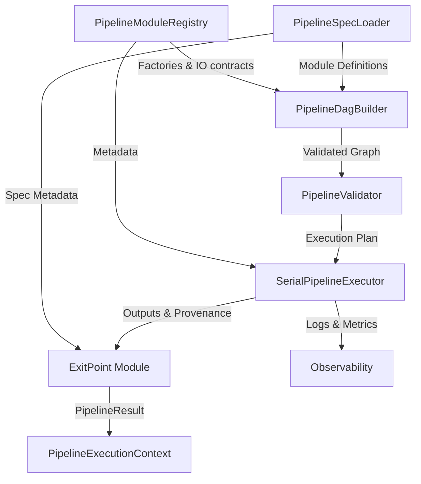

# Dynamic Pipeline Construction Implementation Design

**Document Type:** Implementation Design
**Version:** v2.0
**Status:** Implementation In Progress
**Owner:** Reid Westwood
**Last Updated:** 2025-09-22
**Related Docs:** tea_simulation_design_doc.md

## Overview
This design translates the "Dynamic Pipeline Construction" spec into an implementation plan. It introduces a configurable pipeline DAG constructed from YAML, validates module dependencies before runtime, executes modules serially via topological ordering, and preserves seams for future parallel execution.

## Spec Reference
**Source Spec:** `thoughts/specs/2025-09-21-dynamic-pipeline-construction.md`
**Key Requirements Addressed:**
- Treat pipelines as DAGs derived from YAML
- Enforce single EntryPoint/ExitPoint with validated dependencies
- Provide serial execution planning and result collation
- Prepare interfaces for future parallel execution

## Architecture
A layered architecture separates configuration parsing, graph construction, validation, and execution:

1. **Spec Loader Layer**: Ingests YAML definitions into Pydantic models representing modules, channel bindings, and external data references.
2. **Registry & Metadata Layer**: Exposes module factories and IO contracts, keeping implementations decoupled from orchestration.
3. **Graph Construction & Validation Layer**: Builds a DAG, enforces Entry/Exit rules, checks dependency satisfaction, and detects cycles.
4. **Execution Layer**: Executes modules serially using topological ordering, loading entry artifacts and capturing outputs for the ExitPoint.

An execution context object connects these layers, providing runtime storage for module outputs, module version bookkeeping, and provenance metadata distilled from the pipeline specification.

### Component Relationships Diagram


## Components and Interfaces

### PipelineSpecLoader
**Purpose:** Parse pipeline YAML into structured models.

**Key Methods:**
```python
class PipelineSpecLoader:
    def load(self, config_path: Path) -> PipelineSpecification:
        ...
```

**Data Model:**
```python
class PipelineSpecification(BaseModel):
    modules: dict[str, PipelineModuleSpec]
    metadata: PipelineMetadata | None


class PipelineChannelBinding(BaseModel):
    type_name: str
    channel_name: str
    source: ChannelSource  # enum: entry, module, default
```
- `PipelineModuleSpec` fields include `module_type`, `inputs`/`outputs` mapping to `PipelineChannelBinding`, and validation hints.
- `PipelineMetadata` stores provenance notes such as `run_description` and `output_folder`.

**Dependencies:** `simkit.io.readers.read_yaml_config`, new schema module `simkit/config/pipeline_schema.py`.

**Integration Points:** `entry_point_validate` resolves spec paths and preserves metadata so downstream components can build provenance without auxiliary scenario files.

### PipelineModuleRegistry
**Purpose:** Resolve module types into callable factories with metadata.

**Key Methods:**
```python
class PipelineModuleRegistry:
    def __init__(self):
        self._modules: dict[str, ModuleDescriptor] = {}

    def register(self, module_type: str, descriptor: ModuleDescriptor) -> None: ...
    def get(self, module_type: str) -> ModuleDescriptor: ...
```

**ModuleDescriptor:**
```python
@dataclass(frozen=True)
class ModuleDescriptor:
    module_type: str
    factory: ModuleFactory
    required_inputs: Mapping[str, type[schema.StrictBaseModel]]
    optional_inputs: Mapping[str, type[schema.StrictBaseModel]]
    outputs: Mapping[str, type[schema.StrictBaseModel]]
    version: str
```

The registry bootstraps known modules (`RateDataModule`, etc.) and allows custom Entry/Exit adapters. It can later load plugins dynamically.

### PipelineDagBuilder
**Purpose:** Convert specs + registry metadata into an in-memory DAG.

**Key Methods:**
```python
class PipelineDagBuilder:
    def build(self, spec: PipelineSpecification) -> PipelineGraph:
        ...
```

**PipelineGraph:** wraps module dependencies, adjacency lists, provider lookups, and a cached topological order. Missing providers raise `PipelineGraphError` before scheduling.

### PipelineValidator
**Purpose:** Apply structural and dependency validation before execution.

**Key Checks:**
- Exactly one EntryPoint and ExitPoint present.
- All required inputs for each module produced by upstream node or EntryPoint.
- Optional inputs either provided or defaultable.
- Optional inputs must be declared explicitly, even when defaulted via `None -> channel` sentinel.
- No cycles (detected via `graphlib.TopologicalSorter`).
**Error Model:**
```python
class PipelineValidationError(Exception):
    def __init__(self, message: str, module: str | None = None, details: dict | None = None):
        ...
```

### PipelineExecutionContext
**Purpose:** Hold runtime data and shared services.

**Fields:** registry reference, resolved module outputs (dict keyed by module ID), and module version tracking. Provides helper methods for retrieving outputs, storing results, and recording events.

### SerialPipelineExecutor
**Purpose:** Execute modules in dependency-aware sequence.

**Key Methods:**
```python
class SerialPipelineExecutor:
    def run(self, graph: PipelineGraph, context: PipelineExecutionContext) -> schema.PipelineResult:
        ...
```

**Execution Flow:**
1. Acquire topological order from `graph.topological_order`.
2. For each module:
   - Gather required inputs from context.
   - Call `validate_and_fill_default`, then `run` on module instance.
   - Store `ModuleResult` in context.
   - Log start/end events.
3. After ExitPoint produces final payload, call `exit_point_compose` to return `schema.PipelineResult`.

### EntryPointAdapter / ExitPointAdapter
Provide bridge logic: `EntryPointAdapter` resolves the spec path via `entry_point_validate` and publishes each declared input on a channel so downstream modules can bind without redefining transformations. `ExitPointAdapter` orchestrates final data collation via `exit_point_compose`, enriching provenance with spec metadata (e.g., run descriptions, output folder hints).

## Data Models
Introduce `simkit/config/pipeline_schema.py` with Pydantic models:
```python
class PipelineModuleSpec(StrictBaseModel):
    key: str
    module_type: Literal["EntryPoint", "ExitPoint", "RateData", ...]
    inputs: dict[str, PipelineChannelBinding]
    outputs: dict[str, PipelineChannelBinding]


class PipelineMetadata(StrictBaseModel):
    run_description: str | None = None
    output_folder: str | None = None


class PipelineRunMetadata(StrictBaseModel):
    spec_path: str
    run_description: str | None = None
    output_folder: str | None = None


```

Validation ensures channel names are unique for producers, optional bindings track defaulted inputs, and EntryPoint bindings include artifact paths. `PipelineSpecification` derives module-to-module edges by matching channel names across bindings.

## Error Handling
- Loader errors: wrap YAML parsing failures with file context.
- Validation errors: raise `PipelineValidationError` with actionable message (module name, missing input, etc.).
- Execution errors: propagate module exceptions but annotate with module key for clarity.
- Cycle detection: catch `CycleError` and re-raise with cycle path description from `TopologicalSorter.cycle`.

## Testing Strategy
### Unit Tests
- Spec parsing: YAML with valid/invalid modules (`simkit/tests/pipeline/test_pipeline_schema.py`).
- Registry: cover module registration, metadata accuracy.
- DAG builder: small graphs verifying edge resolution, entry/exit enforcement.
- Validator: missing dependency, duplicate entry/exit, cycle detection cases.
- Executor: executes toy pipelines with stub modules; verifies ordering and provenance metadata propagation.

### Integration Tests
- Replace current `test_pipeline.py` to load a DAG from YAML that mirrors existing linear execution.
- Add tests that assert metadata fields (e.g., `run_description`, `output_folder`) propagate through provenance when executing the demo spec.

### Acceptance Tests
- End-to-end scenario using the new YAML pipeline config ensures final `PipelineResult` is consistent with baseline.
- Failure scenario where YAML intentionally references missing module to assert validation error message.

## Implementation Notes
- Start by introducing Pydantic schema and registry before refactoring execution to use DAG path (minimize regression risk).
- Preserve existing API surface (`execute_pipeline`) by internally delegating to new components that operate solely on pipeline specs.
- Logging: implement structured events via `logging.Logger` with module key context.
- Future parallel execution: design `SerialPipelineExecutor` as strategy implementing a `PipelineExecutor` protocol, enabling drop-in `ParallelPipelineExecutor` later.

## References
- Original spec: `thoughts/specs/2025-09-21-dynamic-pipeline-construction.md`
- Current pipeline orchestration: `simkit/core/pipeline.py:84`
- Module base interface: `simkit/core/base.py:19`
