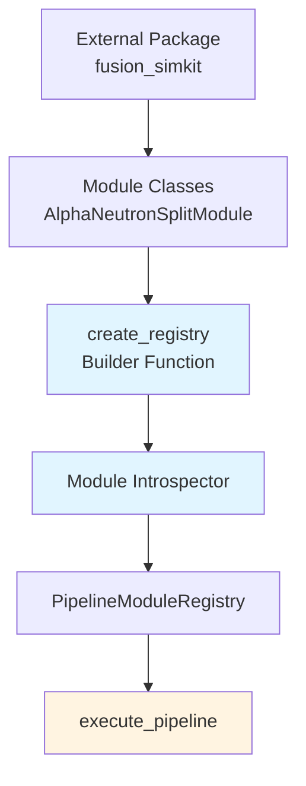

# Custom Module Package Registration - Implementation Design

**Document Type:** Implementation Design
**Version:** v1.0
**Status:** Draft
**Owner:** Reid Westwood
**Last Updated:** 2025-11-07
**Related Docs:** `thoughts/specs/custom-module-package-registration.md`

## Overview

This design enables external packages to register custom modules with the TEAx pipeline execution system through automatic introspection of `ModuleBase` subclasses. The design eliminates manual `ModuleDescriptor` creation by extracting metadata directly from module type hints and Pydantic models.

## Spec Reference

**Source Spec:** `thoughts/specs/custom-module-package-registration.md`

**Key Requirements Addressed:**
- REQ-001: Support external Python packages registering custom modules
- REQ-002: Registry builder that accepts module classes and produces `PipelineModuleRegistry`
- REQ-003: Automatic extraction of module metadata from type hints
- REQ-004: Support mixing built-in and custom modules
- REQ-005: Backward compatibility with existing `execute_pipeline()` API

## Architecture

The implementation consists of three main components working together:



**Data Flow:**
1. External package defines module classes inheriting from `ModuleBase[InputModel, OutputModel]`
2. Package calls `create_registry(modules)` with list of module classes
3. Introspector extracts metadata from each module's type hints and Pydantic models
4. Registry builder creates `ModuleDescriptor` for each module
5. Returns `PipelineModuleRegistry` ready for pipeline execution
6. User passes registry to `execute_pipeline(spec_path, output_dir, registry=registry)`

## Components and Interfaces

### Component 1: Module Introspector

**Purpose:** Extract module metadata from `ModuleBase` subclass type hints

**Location:** `teax/simkit/core/module_introspector.py` (new file)

**Key Functions:**

```python
from typing import get_args, get_origin, Type, Dict, Any
from pydantic import BaseModel
from .base import ModuleBase
from ..config.schema import StrictBaseModel


class ModuleIntrospectionError(Exception):
    """Raised when module introspection fails validation."""
    pass


def extract_io_models(module_cls: Type[ModuleBase]) -> tuple[Type[BaseModel], Type[BaseModel]]:
    """Extract InputModel and OutputModel from ModuleBase generic type hints.

    Args:
        module_cls: Module class that inherits from ModuleBase[InputModel, OutputModel]

    Returns:
        Tuple of (InputModel, OutputModel) types

    Raises:
        ModuleIntrospectionError: If module does not properly inherit ModuleBase with type params

    Example:
        >>> class MyModule(ModuleBase[MyInput, MyOutput]):
        ...     pass
        >>> input_model, output_model = extract_io_models(MyModule)
        >>> assert input_model == MyInput
        >>> assert output_model == MyOutput
    """
    # Get the module's base classes
    orig_bases = getattr(module_cls, '__orig_bases__', ())

    # Find ModuleBase in the inheritance chain
    module_base = None
    for base in orig_bases:
        origin = get_origin(base)
        if origin is not None and issubclass(origin, ModuleBase):
            module_base = base
            break

    if module_base is None:
        raise ModuleIntrospectionError(
            f"Module {module_cls.__name__} must directly inherit from "
            f"ModuleBase[InputModel, OutputModel] with explicit type parameters"
        )

    # Extract type arguments
    type_args = get_args(module_base)
    if len(type_args) != 2:
        raise ModuleIntrospectionError(
            f"Module {module_cls.__name__} must specify exactly 2 type parameters: "
            f"ModuleBase[InputModel, OutputModel]. Found {len(type_args)} parameters."
        )

    input_model, output_model = type_args

    # Validate both are BaseModel subclasses
    if not (isinstance(input_model, type) and issubclass(input_model, BaseModel)):
        raise ModuleIntrospectionError(
            f"InputModel for {module_cls.__name__} must be a Pydantic BaseModel subclass. "
            f"Got: {input_model}"
        )

    if not (isinstance(output_model, type) and issubclass(output_model, BaseModel)):
        raise ModuleIntrospectionError(
            f"OutputModel for {module_cls.__name__} must be a Pydantic BaseModel subclass. "
            f"Got: {output_model}"
        )

    return input_model, output_model


def extract_field_types(
    model_cls: Type[BaseModel]
) -> tuple[Dict[str, type], Dict[str, type]]:
    """Extract required and optional field types from Pydantic model.

    Args:
        model_cls: Pydantic BaseModel class

    Returns:
        Tuple of (required_fields, optional_fields) where each is dict[field_name -> type]

    Example:
        >>> class MyInput(BaseModel):
        ...     required_field: float
        ...     optional_field: float = 1.0
        >>> required, optional = extract_field_types(MyInput)
        >>> assert 'required_field' in required
        >>> assert 'optional_field' in optional
    """
    required_fields: Dict[str, type] = {}
    optional_fields: Dict[str, type] = {}

    # Pydantic v2 uses model_fields
    for field_name, field_info in model_cls.model_fields.items():
        field_type = field_info.annotation

        # Check if field is required (no default and not Optional)
        is_required = field_info.is_required()

        if is_required:
            required_fields[field_name] = field_type
        else:
            optional_fields[field_name] = field_type

    return required_fields, optional_fields


def introspect_module(module_cls: Type[ModuleBase]) -> Dict[str, Any]:
    """Introspect module to extract all metadata needed for ModuleDescriptor.

    Args:
        module_cls: Module class inheriting from ModuleBase[InputModel, OutputModel]

    Returns:
        Dictionary with keys:
        - module_type: str (from class name)
        - input_model: Type[BaseModel]
        - output_model: Type[BaseModel]
        - required_inputs: Dict[str, type]
        - optional_inputs: Dict[str, type]
        - outputs: Dict[str, type]
        - version: str (from module_cls.version)
        - name: str (from module_cls.name)

    Raises:
        ModuleIntrospectionError: If module structure is invalid

    Example:
        >>> class MyModule(ModuleBase[MyInput, MyOutput]):
        ...     name = "my_module"
        ...     version = "v1.0"
        >>> metadata = introspect_module(MyModule)
        >>> assert metadata['module_type'] == 'MyModule'
        >>> assert metadata['version'] == 'v1.0'
    """
    # Validate module has required class attributes
    if not hasattr(module_cls, 'name'):
        raise ModuleIntrospectionError(
            f"Module {module_cls.__name__} must define 'name' class attribute"
        )

    if not hasattr(module_cls, 'version'):
        raise ModuleIntrospectionError(
            f"Module {module_cls.__name__} must define 'version' class attribute"
        )

    # Extract I/O models from type hints
    input_model, output_model = extract_io_models(module_cls)

    # Extract field information from input model
    required_inputs, optional_inputs = extract_field_types(input_model)

    # Extract field information from output model (all outputs are "required")
    outputs, _ = extract_field_types(output_model)

    return {
        'module_type': module_cls.__name__,
        'input_model': input_model,
        'output_model': output_model,
        'required_inputs': required_inputs,
        'optional_inputs': optional_inputs,
        'outputs': outputs,
        'version': module_cls.version,
        'name': module_cls.name,
    }
```

**Validation Strategy:**

The introspector enforces strict requirements to ensure reliable operation:

1. **Explicit Type Parameters**: Module must directly inherit `ModuleBase[InputModel, OutputModel]`
   - ✅ Valid: `class MyModule(ModuleBase[MyInput, MyOutput]):`
   - ❌ Invalid: `class MyModule(ModuleBase):` (no type params)
   - ❌ Invalid: Indirect inheritance without type params

2. **Pydantic BaseModel Types**: Both InputModel and OutputModel must be BaseModel subclasses
   - Validates using `issubclass(model, BaseModel)`
   - Clear error messages if validation fails

3. **Required Class Attributes**: Module must define `name` and `version` attributes
   - Used for logging, debugging, and provenance tracking

4. **Field Type Extraction**: Uses Pydantic's `model_fields` to distinguish required vs optional
   - Required: `field_info.is_required() == True`
   - Optional: `field_info.is_required() == False` (has default value)

**Dependencies:** `typing.get_args`, `typing.get_origin`, `pydantic`

**Integration Points:**
- Imports `ModuleBase` from `teax.simkit.core.base`
- Validates against Pydantic BaseModel
- Used by registry builder to generate `ModuleDescriptor`

---

### Component 2: Registry Builder

**Purpose:** Create `PipelineModuleRegistry` from list of module classes

**Location:** `teax/simkit/core/registry_builder.py` (new file)

**Key Functions:**

```python
from typing import List, Type
from .base import ModuleBase
from .pipeline_registry import ModuleDescriptor, PipelineModuleRegistry
from .module_introspector import introspect_module, ModuleIntrospectionError


def create_registry(
    modules: List[Type[ModuleBase]],
    include_builtins: bool = False,
    module_type_override: dict[Type[ModuleBase], str] | None = None,
) -> PipelineModuleRegistry:
    """Create PipelineModuleRegistry from list of module classes.

    This function automatically introspects each module class to extract metadata
    and creates ModuleDescriptor instances without manual specification.

    Args:
        modules: List of ModuleBase subclasses to register
        include_builtins: If True, starts with builtin TEAx modules and adds custom modules
        module_type_override: Optional dict mapping module classes to custom module_type names
                             (defaults to class.__name__ if not provided)

    Returns:
        PipelineModuleRegistry ready for pipeline execution

    Raises:
        ModuleIntrospectionError: If any module fails validation
        ValueError: If duplicate module_type names detected

    Example:
        >>> # Create registry with only custom modules
        >>> registry = create_registry([AlphaNeutronSplitModule, BlanketThermalPowerModule])

        >>> # Create registry mixing builtins and custom
        >>> registry = create_registry(
        ...     [AlphaNeutronSplitModule],
        ...     include_builtins=True
        ... )

        >>> # Override module type name
        >>> registry = create_registry(
        ...     [AlphaNeutronSplitModule],
        ...     module_type_override={AlphaNeutronSplitModule: "AlphaSplit"}
        ... )
    """
    # Start with builtins if requested
    if include_builtins:
        registry = PipelineModuleRegistry.from_static_modules()
    else:
        registry = PipelineModuleRegistry()

    module_type_override = module_type_override or {}

    # Track seen module types for duplicate detection
    seen_module_types = set(registry._modules.keys()) if include_builtins else set()

    # Process each module
    for module_cls in modules:
        try:
            # Introspect module to get metadata
            metadata = introspect_module(module_cls)

            # Determine module_type (allow override)
            module_type = module_type_override.get(module_cls, metadata['module_type'])

            # Check for duplicates
            if module_type in seen_module_types:
                raise ValueError(
                    f"Duplicate module_type '{module_type}' detected. "
                    f"Module types must be unique across all registered modules."
                )
            seen_module_types.add(module_type)

            # Create factory function
            def _make_factory(cls: Type[ModuleBase]):
                def factory():
                    return cls()
                return factory

            factory = _make_factory(module_cls)

            # Create ModuleDescriptor
            descriptor = ModuleDescriptor(
                module_type=module_type,
                factory=factory,
                required_inputs=metadata['required_inputs'],
                optional_inputs=metadata['optional_inputs'],
                outputs=metadata['outputs'],
                version=metadata['version'],
            )

            # Register in registry
            registry.register(module_type, descriptor)

        except ModuleIntrospectionError as e:
            # Re-raise with module context
            raise ModuleIntrospectionError(
                f"Failed to introspect module {module_cls.__name__}: {e}"
            ) from e

    return registry


def create_fusion_registry_example() -> PipelineModuleRegistry:
    """Example function showing how external packages would create registries.

    This pattern would be implemented in fusion_simkit.__init__.py or similar.
    External users would import this function rather than building registries manually.

    Returns:
        Registry with all fusion physics modules

    Example:
        >>> from fusion_simkit import create_fusion_registry
        >>> from teax.simkit.core.pipeline import execute_pipeline
        >>>
        >>> registry = create_fusion_registry()
        >>> result = execute_pipeline(
        ...     "fusion_pipeline.yaml",
        ...     "outputs/",
        ...     registry=registry
        ... )
    """
    from tests.teax_simkit.modules.alphaneutronsplit import AlphaNeutronSplitModule
    from tests.teax_simkit.modules.blanketthermalpower import BlanketThermalPowerModule
    from tests.teax_simkit.modules.grosselectricpower import GrossElectricPowerModule

    return create_registry([
        AlphaNeutronSplitModule,
        BlanketThermalPowerModule,
        GrossElectricPowerModule,
    ])
```

**Design Decisions:**

1. **List-based API**: Simple and explicit, matches Python conventions
2. **`include_builtins` flag**: Allows mixing built-in TEAx modules with custom modules
3. **`module_type_override`**: Provides escape hatch for name conflicts without renaming classes
4. **Duplicate detection**: Fails fast if module_type names collide
5. **Factory closure**: Uses closure pattern to capture module class correctly

**Error Handling:**

- Validates each module during registration
- Provides clear error messages with module names
- Fails fast on first error (no partial registries)
- Re-raises introspection errors with context

**Dependencies:** `module_introspector`, `pipeline_registry`

**Integration Points:**
- Creates `ModuleDescriptor` instances compatible with existing registry
- Wraps `PipelineModuleRegistry` - no changes to registry class needed
- External packages would expose similar functions (e.g., `fusion_simkit.create_fusion_registry()`)

---

### Component 3: Pipeline Execution Enhancement

**Purpose:** Accept custom registries in pipeline execution

**Location:** `teax/simkit/core/pipeline.py` (modify existing)

**Modified Function:**

```python
def execute_pipeline(
    spec_path: str | Path,
    output_dir: str | Path | None = None,
    registry: PipelineModuleRegistry | None = None,
) -> RunResult:
    """Execute pipeline with optional custom module registry.

    Args:
        spec_path: Path to pipeline YAML specification
        output_dir: Optional output directory (defaults to temp dir)
        registry: Optional custom module registry. If None, uses built-in TEAx modules.

    Returns:
        RunResult with execution outputs, metadata, and provenance

    Example:
        >>> # Execute with built-in modules (backward compatible)
        >>> result = execute_pipeline("demo_pipeline.yaml", "outputs/")

        >>> # Execute with custom registry
        >>> from fusion_simkit import create_fusion_registry
        >>> registry = create_fusion_registry()
        >>> result = execute_pipeline(
        ...     "fusion_pipeline.yaml",
        ...     "outputs/",
        ...     registry=registry
        ... )
    """
    specification = entry_point_validate(spec_path)

    # Use custom registry if provided, otherwise default to builtins
    if registry is None:
        registry = PipelineModuleRegistry.from_static_modules()

    router = create_default_router()
    executor = SerialPipelineExecutor(registry, output_router=router)
    context = PipelineExecutionContext(registry)

    graph = executor.build_graph(specification)
    try:
        metadata = specification.metadata
        run_name_hint = None
        if metadata and metadata.output_folder:
            run_name_hint = metadata.output_folder
        elif metadata and metadata.run_description:
            run_name_hint = metadata.run_description
        elif specification.source_path is not None:
            run_name_hint = specification.source_path.stem

        base_output_dir = Path(output_dir) if output_dir is not None else None

        run_result = executor.run(
            graph,
            context,
            base_output_dir=base_output_dir,
            run_name=run_name_hint,
            pipeline_metadata=metadata,
        )
        produced_outputs = run_result.outputs
    except PipelineValidationError as exc:  # pragma: no cover
        raise RuntimeError(f"Pipeline execution failed: {exc}") from exc

    pipeline_metadata = _build_pipeline_metadata(specification)
    provenance = _build_provenance(specification, run_result.module_versions, pipeline_metadata)

    return replace(
        run_result,
        pipeline_metadata=pipeline_metadata,
        provenance=provenance,
    )
```

**Changes:**
- **Line 65**: Add `registry: PipelineModuleRegistry | None = None` parameter
- **Lines 69-71**: Replace hardcoded `from_static_modules()` with conditional logic
- **Documentation**: Update docstring with example

**Backward Compatibility:**
- Default `registry=None` maintains existing behavior
- No changes required to existing code calling `execute_pipeline()`
- All existing tests continue to pass

**Dependencies:** None (only adds optional parameter)

**Integration Points:**
- Registry passed to `SerialPipelineExecutor` (already accepts registry)
- Registry passed to `PipelineExecutionContext` (already accepts registry)
- No changes to downstream components needed

---

## Data Models

### Module Metadata Structure

```python
@dataclass
class ModuleMetadata:
    """Internal data structure for introspected module metadata."""
    module_type: str
    input_model: Type[BaseModel]
    output_model: Type[BaseModel]
    required_inputs: Dict[str, type]
    optional_inputs: Dict[str, type]
    outputs: Dict[str, type]
    version: str
    name: str
```

This is an internal structure used by the introspector. It maps 1:1 to `ModuleDescriptor` fields:
- `module_type` → `ModuleDescriptor.module_type`
- `required_inputs` → `ModuleDescriptor.required_inputs`
- `optional_inputs` → `ModuleDescriptor.optional_inputs`
- `outputs` → `ModuleDescriptor.outputs`
- `version` → `ModuleDescriptor.version`

### Validation Rules

**Module Class Requirements:**
```python
# ✅ VALID: Explicit type parameters, has name and version
class ValidModule(ModuleBase[ValidInput, ValidOutput]):
    name = "valid_module"
    version = "v1.0"

    def validate_and_fill_default(self, inputs: dict) -> ValidInput:
        return ValidInput(**inputs)

    def run(self, inputs: dict) -> ModuleResult[ValidOutput]:
        # Implementation
        return ModuleResult(data=output)

# ❌ INVALID: Missing type parameters
class InvalidModule1(ModuleBase):
    pass

# ❌ INVALID: Missing name attribute
class InvalidModule2(ModuleBase[MyInput, MyOutput]):
    version = "v1.0"

# ❌ INVALID: InputModel not a BaseModel
class InvalidModule3(ModuleBase[dict, MyOutput]):
    name = "invalid"
    version = "v1.0"
```

**Pydantic Model Requirements:**
```python
from pydantic import BaseModel, Field

# ✅ VALID: Proper Pydantic model with required and optional fields
class ValidInput(BaseModel):
    required_field: float = Field(..., gt=0, description="Required field")
    optional_field: float = Field(default=1.0, description="Optional field")

# ✅ VALID: All required fields
class ValidOutput(BaseModel):
    result: float
    metadata: str

# ⚠️ EDGE CASE: Empty model (valid but unusual)
class EmptyInput(BaseModel):
    pass  # No fields - module takes no inputs
```

---

## Error Handling

### Error Types

**1. ModuleIntrospectionError**
```python
class ModuleIntrospectionError(Exception):
    """Raised when module structure fails validation."""
    pass
```

Raised for:
- Missing type parameters in `ModuleBase[InputModel, OutputModel]`
- InputModel/OutputModel not BaseModel subclasses
- Missing `name` or `version` class attributes
- Invalid type hint structures

**Example Error Messages:**
```
ModuleIntrospectionError: Module AlphaNeutronSplitModule must directly inherit from
ModuleBase[InputModel, OutputModel] with explicit type parameters

ModuleIntrospectionError: InputModel for AlphaNeutronSplitModule must be a Pydantic
BaseModel subclass. Got: <class 'dict'>

ModuleIntrospectionError: Module AlphaNeutronSplitModule must define 'version'
class attribute
```

**2. ValueError (Duplicate module_type)**
```python
ValueError: Duplicate module_type 'AlphaNeutronSplit' detected. Module types must be
unique across all registered modules.
```

Raised when:
- Two modules have same `__name__` (class name)
- `module_type_override` creates collision with built-in or other custom module

**Recovery Strategy:**
- Use `module_type_override` to rename one of the modules
- Rename the module class
- Remove one of the duplicate modules from list

**3. Existing Pipeline Errors**

Custom modules can still trigger existing validation errors:
- `PipelineValidationError`: Module outputs don't match pipeline expectations
- `KeyError`: Pipeline references module_type not in registry
- Pydantic `ValidationError`: Input data doesn't match schema

---

## Testing Strategy

### Unit Tests

**Test File:** `teax/simkit/tests/core/test_module_introspector.py`

```python
import pytest
from pydantic import BaseModel, Field
from teax.simkit.core.base import ModuleBase, ModuleResult
from teax.simkit.core.module_introspector import (
    extract_io_models,
    extract_field_types,
    introspect_module,
    ModuleIntrospectionError,
)


class SimpleInput(BaseModel):
    value: float


class SimpleOutput(BaseModel):
    result: float


class ValidModule(ModuleBase[SimpleInput, SimpleOutput]):
    name = "valid_module"
    version = "v1.0"

    def validate_and_fill_default(self, inputs):
        return SimpleInput(**inputs)

    def run(self, inputs):
        return ModuleResult(data=SimpleOutput(result=0.0))


def test_extract_io_models_success():
    """Test extracting InputModel and OutputModel from valid module."""
    input_model, output_model = extract_io_models(ValidModule)
    assert input_model == SimpleInput
    assert output_model == SimpleOutput


def test_extract_io_models_missing_type_params():
    """Test error when module doesn't specify type parameters."""
    class InvalidModule(ModuleBase):
        pass

    with pytest.raises(ModuleIntrospectionError, match="must directly inherit"):
        extract_io_models(InvalidModule)


def test_extract_io_models_wrong_param_count():
    """Test error when module specifies wrong number of type parameters."""
    # This would be a syntax error in practice, but test the validation
    with pytest.raises(ModuleIntrospectionError, match="exactly 2 type parameters"):
        # Simulated invalid structure
        pass


def test_extract_io_models_non_basemodel_input():
    """Test error when InputModel is not a BaseModel subclass."""
    class InvalidInput:
        pass

    class InvalidModule(ModuleBase[InvalidInput, SimpleOutput]):  # type: ignore
        pass

    with pytest.raises(ModuleIntrospectionError, match="must be a Pydantic BaseModel"):
        extract_io_models(InvalidModule)


def test_extract_field_types_required_and_optional():
    """Test extracting required and optional fields from Pydantic model."""
    class MixedFieldsModel(BaseModel):
        required_field: float
        optional_field: float = 1.0
        optional_with_none: float | None = None

    required, optional = extract_field_types(MixedFieldsModel)

    assert 'required_field' in required
    assert 'optional_field' in optional
    assert 'optional_with_none' in optional


def test_extract_field_types_all_required():
    """Test model with only required fields."""
    class AllRequiredModel(BaseModel):
        field1: float
        field2: str

    required, optional = extract_field_types(AllRequiredModel)

    assert len(required) == 2
    assert len(optional) == 0


def test_extract_field_types_all_optional():
    """Test model with only optional fields."""
    class AllOptionalModel(BaseModel):
        field1: float = 1.0
        field2: str = "default"

    required, optional = extract_field_types(AllOptionalModel)

    assert len(required) == 0
    assert len(optional) == 2


def test_introspect_module_success():
    """Test full module introspection on valid module."""
    metadata = introspect_module(ValidModule)

    assert metadata['module_type'] == 'ValidModule'
    assert metadata['input_model'] == SimpleInput
    assert metadata['output_model'] == SimpleOutput
    assert metadata['version'] == 'v1.0'
    assert metadata['name'] == 'valid_module'
    assert 'value' in metadata['required_inputs']


def test_introspect_module_missing_name():
    """Test error when module missing 'name' attribute."""
    class MissingNameModule(ModuleBase[SimpleInput, SimpleOutput]):
        version = "v1.0"

    with pytest.raises(ModuleIntrospectionError, match="must define 'name'"):
        introspect_module(MissingNameModule)


def test_introspect_module_missing_version():
    """Test error when module missing 'version' attribute."""
    class MissingVersionModule(ModuleBase[SimpleInput, SimpleOutput]):
        name = "missing_version"

    with pytest.raises(ModuleIntrospectionError, match="must define 'version'"):
        introspect_module(MissingVersionModule)
```

**Test File:** `teax/simkit/tests/core/test_registry_builder.py`

```python
import pytest
from pydantic import BaseModel
from teax.simkit.core.base import ModuleBase, ModuleResult
from teax.simkit.core.registry_builder import create_registry
from teax.simkit.core.module_introspector import ModuleIntrospectionError


class Input1(BaseModel):
    value: float


class Output1(BaseModel):
    result: float


class Module1(ModuleBase[Input1, Output1]):
    name = "module1"
    version = "v1.0"

    def validate_and_fill_default(self, inputs):
        return Input1(**inputs)

    def run(self, inputs):
        return ModuleResult(data=Output1(result=0.0))


class Module2(ModuleBase[Input1, Output1]):
    name = "module2"
    version = "v1.0"

    def validate_and_fill_default(self, inputs):
        return Input1(**inputs)

    def run(self, inputs):
        return ModuleResult(data=Output1(result=0.0))


def test_create_registry_single_module():
    """Test creating registry with single module."""
    registry = create_registry([Module1])

    assert registry.has('Module1')
    descriptor = registry.get('Module1')
    assert descriptor.version == 'v1.0'


def test_create_registry_multiple_modules():
    """Test creating registry with multiple modules."""
    registry = create_registry([Module1, Module2])

    assert registry.has('Module1')
    assert registry.has('Module2')


def test_create_registry_with_builtins():
    """Test creating registry that includes built-in modules."""
    registry = create_registry([Module1], include_builtins=True)

    # Custom module
    assert registry.has('Module1')

    # Built-in modules
    assert registry.has('RateData')
    assert registry.has('ConfigureBattery')


def test_create_registry_module_type_override():
    """Test overriding module_type name."""
    registry = create_registry(
        [Module1],
        module_type_override={Module1: "CustomName"}
    )

    assert registry.has('CustomName')
    assert not registry.has('Module1')


def test_create_registry_duplicate_names():
    """Test error when duplicate module_type names detected."""
    # Create two modules with same class name (in different namespaces)
    class DuplicateModule(ModuleBase[Input1, Output1]):
        name = "dup"
        version = "v1.0"

        def validate_and_fill_default(self, inputs):
            return Input1(**inputs)

        def run(self, inputs):
            return ModuleResult(data=Output1(result=0.0))

    with pytest.raises(ValueError, match="Duplicate module_type"):
        create_registry([DuplicateModule, DuplicateModule])


def test_create_registry_invalid_module():
    """Test error when module fails introspection."""
    class InvalidModule(ModuleBase):  # Missing type params
        name = "invalid"
        version = "v1.0"

    with pytest.raises(ModuleIntrospectionError):
        create_registry([InvalidModule])


def test_registry_factory_creates_instances():
    """Test that factory functions create module instances."""
    registry = create_registry([Module1])
    descriptor = registry.get('Module1')

    instance1 = descriptor.factory()
    instance2 = descriptor.factory()

    assert isinstance(instance1, Module1)
    assert isinstance(instance2, Module1)
    assert instance1 is not instance2  # New instance each time
```

### Integration Tests

**Test File:** `teax/simkit/tests/test_custom_module_pipeline.py`

```python
import pytest
from pathlib import Path
from pydantic import BaseModel, Field
from teax.simkit.core.base import ModuleBase, ModuleResult
from teax.simkit.core.registry_builder import create_registry
from teax.simkit.core.pipeline import execute_pipeline


class FusionInput(BaseModel):
    p_fusion: float = Field(..., gt=0)


class FusionOutput(BaseModel):
    p_alpha: float
    p_neutron: float


class AlphaNeutronSplitModule(ModuleBase[FusionInput, FusionOutput]):
    name = "AlphaNeutronSplit"
    version = "v1.0"

    def validate_and_fill_default(self, inputs):
        return FusionInput(**inputs)

    def run(self, inputs):
        validated = self.validate_and_fill_default(inputs)
        p_fusion = validated.p_fusion

        # D-T fusion: 3.52 MeV alpha, 14.06 MeV neutron (total 17.58 MeV)
        p_alpha = p_fusion * 3.52 / 17.58
        p_neutron = p_fusion * 14.06 / 17.58

        return ModuleResult(
            data=FusionOutput(p_alpha=p_alpha, p_neutron=p_neutron)
        )


@pytest.fixture
def fusion_pipeline_yaml(tmp_path):
    """Create test pipeline YAML."""
    pipeline_content = """
metadata:
  run_description: Test fusion pipeline
  output_folder: fusion_test

modules:
  entry_point:
    module_type: EntryPoint
    inputs:
      p_fusion: float 1000.0

  split:
    module_type: AlphaNeutronSplitModule
    inputs:
      p_fusion: float p_fusion
    outputs:
      p_alpha: float p_alpha
      p_neutron: float p_neutron

  exit_point:
    module_type: ExitPoint
    outputs:
      p_alpha: float p_alpha.json
      p_neutron: float p_neutron.json
"""
    yaml_path = tmp_path / "fusion_pipeline.yaml"
    yaml_path.write_text(pipeline_content)
    return yaml_path


def test_execute_pipeline_with_custom_registry(fusion_pipeline_yaml, tmp_path):
    """Test end-to-end pipeline execution with custom module registry."""
    # Create custom registry
    registry = create_registry([AlphaNeutronSplitModule])

    # Execute pipeline
    output_dir = tmp_path / "outputs"
    result = execute_pipeline(
        fusion_pipeline_yaml,
        output_dir,
        registry=registry
    )

    # Verify execution succeeded
    assert result is not None
    assert 'p_alpha' in result.outputs
    assert 'p_neutron' in result.outputs

    # Verify values
    p_alpha = result.outputs['p_alpha']
    p_neutron = result.outputs['p_neutron']
    assert pytest.approx(p_alpha, rel=1e-6) == 1000.0 * 3.52 / 17.58
    assert pytest.approx(p_neutron, rel=1e-6) == 1000.0 * 14.06 / 17.58


def test_execute_pipeline_custom_and_builtin(tmp_path):
    """Test pipeline mixing custom and built-in modules."""
    # Create pipeline using both custom fusion module and built-in modules
    # (test would require appropriate YAML mixing both types)
    registry = create_registry([AlphaNeutronSplitModule], include_builtins=True)

    # Verify registry has both types
    assert registry.has('AlphaNeutronSplitModule')
    assert registry.has('RateData')  # Built-in


def test_execute_pipeline_backward_compatible(tmp_path):
    """Test that execute_pipeline still works without registry parameter."""
    # Create pipeline using only built-in modules
    pipeline_yaml = tmp_path / "demo.yaml"
    # (use existing demo pipeline YAML)

    # Call without registry parameter - should use built-ins
    result = execute_pipeline(pipeline_yaml, tmp_path / "outputs")

    assert result is not None
```

### Acceptance Tests

Tests that verify spec requirements:

```python
def test_req001_external_package_registration():
    """REQ-001: External packages can register custom modules."""
    from tests.teax_simkit.modules.alphaneutronsplit import AlphaNeutronSplitModule

    registry = create_registry([AlphaNeutronSplitModule])
    assert registry.has('AlphaNeutronSplitModule')


def test_req002_registry_builder_from_classes():
    """REQ-002: Registry builder accepts module classes."""
    modules = [Module1, Module2]
    registry = create_registry(modules)

    assert registry.has('Module1')
    assert registry.has('Module2')


def test_req003_automatic_metadata_extraction():
    """REQ-003: Metadata extracted automatically from type hints."""
    # No manual ModuleDescriptor creation required
    registry = create_registry([Module1])
    descriptor = registry.get('Module1')

    # Verify metadata was extracted
    assert descriptor.version == 'v1.0'
    assert 'value' in descriptor.required_inputs


def test_req004_mixing_builtin_and_custom():
    """REQ-004: Support mixing built-in and custom modules."""
    registry = create_registry([Module1], include_builtins=True)

    assert registry.has('Module1')  # Custom
    assert registry.has('RateData')  # Built-in


def test_req005_backward_compatibility():
    """REQ-005: Backward compatible with existing API."""
    # Old code still works
    result = execute_pipeline("demo.yaml", "outputs/")
    assert result is not None

    # New code with registry works
    registry = create_registry([Module1])
    result = execute_pipeline("custom.yaml", "outputs/", registry=registry)
    assert result is not None
```

---

## Implementation Notes

### Key Technical Decisions

**1. Type Introspection Approach**

Use `typing.get_args()` and `typing.get_origin()` instead of `__class_getitem__`:
- ✅ Works with all generic types
- ✅ Part of Python stdlib (3.8+)
- ✅ Handles complex type hints correctly
- ❌ Requires direct inheritance with type params (not indirect)

**Decision:** Accept the limitation of requiring direct inheritance. This makes introspection reliable and enforces clear module definitions.

**2. Pydantic Field Detection**

Use `model_fields` with `field_info.is_required()`:
- ✅ Pydantic v2 native API
- ✅ Correctly distinguishes required vs optional
- ✅ Handles Field() with defaults
- ✅ Works with complex validators

**Alternative considered:** Parse `__fields__` directly - rejected because it's lower-level and less robust.

**3. Factory Closure Pattern**

```python
def _make_factory(cls: Type[ModuleBase]):
    def factory():
        return cls()
    return factory
```

Why closure instead of lambda:
- ✅ Correctly captures `cls` variable (avoids late-binding issue)
- ✅ Matches existing pattern in `from_static_modules()`
- ✅ Easy to extend for parameterized construction later

**4. No Entry Points (Initial Implementation)**

Skip setuptools entry point discovery for v1:
- Simpler implementation
- User feedback indicates smaller scale
- External packages can still provide helper functions
- Can add entry point discovery in v2 if needed

**5. Validation Strictness**

Enforce strict validation requirements:
- Required class attributes (`name`, `version`)
- Explicit type parameters
- BaseModel subclasses only

**Rationale:** Strict validation prevents subtle bugs and makes introspection reliable. Better to fail fast with clear errors than have mysterious runtime failures.

### Gotchas and Edge Cases

**1. Late Binding in Lambdas**

❌ **Wrong:**
```python
for module_cls in modules:
    factory = lambda: module_cls()  # BUG: captures loop variable
```

✅ **Correct:**
```python
for module_cls in modules:
    def _make_factory(cls=module_cls):
        return lambda: cls()
    factory = _make_factory()
```

**2. Indirect Inheritance**

❌ **Unsupported:**
```python
class BasePhysicsModule(ModuleBase[PhysicsInput, PhysicsOutput]):
    pass

class SpecificModule(BasePhysicsModule):  # Indirect - introspection will fail
    pass
```

✅ **Supported:**
```python
class SpecificModule(ModuleBase[SpecificInput, SpecificOutput]):  # Direct
    pass
```

**Workaround:** External packages must explicitly specify type params on each module class.

**3. Module Type Name Collisions**

If external package has module with same name as built-in:
```python
# Built-in: CostCalculator
# Custom: CostCalculator (collision!)

# Solution 1: Rename custom module class
class FusionCostCalculator(ModuleBase[...]):
    pass

# Solution 2: Use module_type_override
registry = create_registry(
    [CostCalculator],
    module_type_override={CostCalculator: "FusionCostCalculator"}
)
```

**4. Empty Input/Output Models**

Valid but unusual:
```python
class NoInput(BaseModel):
    pass  # Module takes no inputs

class ConstantModule(ModuleBase[NoInput, SomeOutput]):
    pass
```

Introspection handles this correctly (empty dicts for required/optional inputs).

**5. Pydantic Computed Fields**

`@computed_field` are excluded from `model_fields`:
```python
class ModelWithComputed(BaseModel):
    base_value: float

    @computed_field
    @property
    def doubled(self) -> float:
        return self.base_value * 2
```

Introspection only sees `base_value` - computed fields don't appear in required/optional inputs. This is correct behavior (computed fields aren't inputs).

### Performance Considerations

**Introspection Cost:**
- Introspection runs once at registry creation time
- O(N) where N = number of modules
- Negligible for expected scale (< 100 modules)

**Factory Performance:**
- Lazy instantiation (no cost until module used)
- Same performance as existing `from_static_modules()` pattern

**Registry Lookup:**
- O(1) dict lookup (unchanged)
- No performance impact on pipeline execution

### Future Enhancements

**Phase 2: Entry Point Discovery**

Add automatic discovery via setuptools entry points:
```python
def discover_plugins(namespace: str = "teax.modules") -> List[Type[ModuleBase]]:
    """Discover modules via entry points."""
    from importlib.metadata import entry_points

    modules = []
    for ep in entry_points(group=namespace):
        module_cls = ep.load()
        modules.append(module_cls)

    return modules

# Usage
registry = create_registry(discover_plugins())
```

**Phase 3: Lazy Loading**

Add lazy module loading to reduce import time:
```python
def create_registry_lazy(
    modules: List[str],  # Module import paths instead of classes
) -> PipelineModuleRegistry:
    """Create registry with lazy module imports."""
    # Import modules only when factory is called
```

**Phase 4: Validation Caching**

Cache introspection results:
```python
_introspection_cache: Dict[Type[ModuleBase], Dict[str, Any]] = {}

def introspect_module(module_cls):
    if module_cls not in _introspection_cache:
        _introspection_cache[module_cls] = _introspect_impl(module_cls)
    return _introspection_cache[module_cls]
```

---

## References

### Codebase References

- **Original spec:** `thoughts/specs/custom-module-package-registration.md`
- **Related ticket:** `thoughts/tickets/custom-module-package-registration.md`
- **Base classes:** `teax/simkit/core/base.py:19-30`
- **Registry implementation:** `teax/simkit/core/pipeline_registry.py:20-161`
- **Pipeline executor:** `teax/simkit/core/pipeline.py:62-102`
- **Example custom modules:** `tests/teax_simkit/modules/alphaneutronsplit.py`
- **Manual registry fixture:** `tests/teax_simkit/conftest.py:26-91`

### External References

- **Python typing module:** https://docs.python.org/3/library/typing.html#typing.get_args
- **Pydantic field info:** https://docs.pydantic.dev/latest/api/fields/#pydantic.fields.FieldInfo
- **Pydantic model_fields:** https://docs.pydantic.dev/latest/api/base_model/#pydantic.BaseModel.model_fields

### Similar Implementations

- **Xarray backends:** How xarray handles external backend registration
- **Pytest plugins:** Hook-based plugin system (more complex than needed here)
- **Flask extensions:** Two-phase initialization pattern (not applicable)

---

## Appendix: Complete Usage Example

**External Package Structure: `fusion_simkit`**

```
fusion_simkit/
├── pyproject.toml
├── fusion_simkit/
│   ├── __init__.py
│   ├── modules/
│   │   ├── __init__.py
│   │   ├── alpha_neutron_split.py
│   │   ├── blanket_thermal_power.py
│   │   └── gross_electric_power.py
│   └── implementations/
│       ├── alpha_neutron_split_impl.py
│       └── ...
└── tests/
    └── test_modules.py
```

**fusion_simkit/__init__.py:**
```python
"""Fusion reactor physics modules for TEAx."""

__version__ = "1.0.0"

from teax.simkit.core.registry_builder import create_registry
from .modules.alpha_neutron_split import AlphaNeutronSplitModule
from .modules.blanket_thermal_power import BlanketThermalPowerModule
from .modules.gross_electric_power import GrossElectricPowerModule


def create_fusion_registry(include_builtins: bool = False):
    """Create registry with all fusion physics modules.

    Args:
        include_builtins: If True, includes standard TEAx modules

    Returns:
        PipelineModuleRegistry ready for fusion pipeline execution

    Example:
        >>> from fusion_simkit import create_fusion_registry
        >>> from teax.simkit.core.pipeline import execute_pipeline
        >>>
        >>> registry = create_fusion_registry()
        >>> result = execute_pipeline(
        ...     "fusion_power_balance.yaml",
        ...     "outputs/",
        ...     registry=registry
        ... )
    """
    return create_registry(
        [
            AlphaNeutronSplitModule,
            BlanketThermalPowerModule,
            GrossElectricPowerModule,
        ],
        include_builtins=include_builtins,
    )


__all__ = [
    'create_fusion_registry',
    'AlphaNeutronSplitModule',
    'BlanketThermalPowerModule',
    'GrossElectricPowerModule',
]
```

**User Script:**
```python
"""Run fusion power balance analysis."""

from pathlib import Path
from fusion_simkit import create_fusion_registry
from teax.simkit.core.pipeline import execute_pipeline

# Create registry with fusion modules
registry = create_fusion_registry()

# Execute fusion pipeline
result = execute_pipeline(
    spec_path="pipelines/fusion_power_balance.yaml",
    output_dir="outputs/power_balance_run_001",
    registry=registry,
)

# Access results
print(f"Gross electric power: {result.outputs['p_electric_gross']} MW")
print(f"Pipeline completed in {result.execution_time:.2f}s")
```

**Pipeline YAML (`pipelines/fusion_power_balance.yaml`):**
```yaml
metadata:
  run_description: Fusion reactor power balance calculation
  output_folder: power_balance_results

modules:
  entry_point:
    module_type: EntryPoint
    inputs:
      p_fusion: float 500.0
      p_input: float 50.0
      m_neutron: float 1.2
      eta_thermal: float 0.40
      eta_direct: float 0.50
      f_pump: float 0.05
      eta_pump: float 0.85
      f_subsystem: float 0.03

  alpha_neutron_split:
    module_type: AlphaNeutronSplitModule
    inputs:
      p_fusion: float p_fusion
    outputs:
      p_alpha: float p_alpha
      p_neutron: float p_neutron

  blanket_thermal:
    module_type: BlanketThermalPowerModule
    inputs:
      p_neutron: float p_neutron
      p_input: float p_input
      m_neutron: float m_neutron
      eta_thermal: float eta_thermal
      f_pump: float f_pump
      eta_pump: float eta_pump
      f_subsystem: float f_subsystem
    outputs:
      p_thermal: float p_thermal

  electric_power:
    module_type: GrossElectricPowerModule
    inputs:
      p_thermal: float p_thermal
      p_alpha: float p_alpha
      eta_thermal: float eta_thermal
      eta_direct: float eta_direct
    outputs:
      p_electric_gross: float p_electric_gross

  exit_point:
    module_type: ExitPoint
    outputs:
      p_alpha: float p_alpha.json
      p_neutron: float p_neutron.json
      p_thermal: float p_thermal.json
      p_electric_gross: float p_electric_gross.json
```

This example shows the complete end-to-end workflow for external package developers and end users.
